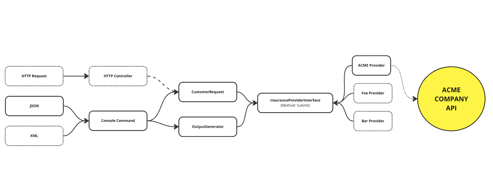

# Insurance Assessment

## Project Overview 
You can see the scenario in the following diagram.

<p></p>

- The app can get many providers, for now we just have Acme.
- you can set provider from the commandline
- you can specify the input file in console

## Under the Hood
I tried to juggle time and tasks carefully for this assignment, knowing real-world projects demand better code quality and organization. While working on it, I aimed to keep things neat and tidy, focusing on making different parts work together smoothly. To do this, I used Symfony framework to connect services when needed. For example, I tried to use abstractions to decouple the objects.

This way we can easily swap the implementations without changing the codebase.

Also, we are using custom **Exceptions** to handle the errors and exceptions in a more readable way.

Also I created the Dummy Acme provider object to simulate the calling Acme provider api

## Requirements

- docker
- docker-compose

## Installation

1. Change directory.
    ````bash
    cd check24-assessment
   ````
2. Start docker.
    ````bash
    docker-compose up -d
    ````
3. Enter to the container.
   ````bash
    docker compose exec -ucheck24 php bash
    ````
4. Install vendors.
    ````bash
   composer install
   ````
5. create env file
    ````bash
   cp .env.example .env
   ````
5. Run The console Command.
    ````bash
    ./bin/console insurance:quote ACME --file=/data/input.json
   ````
6. Run the tests.
   ````bash
   ./vendor/bin/phpunit tests --testdox
    ````
   
