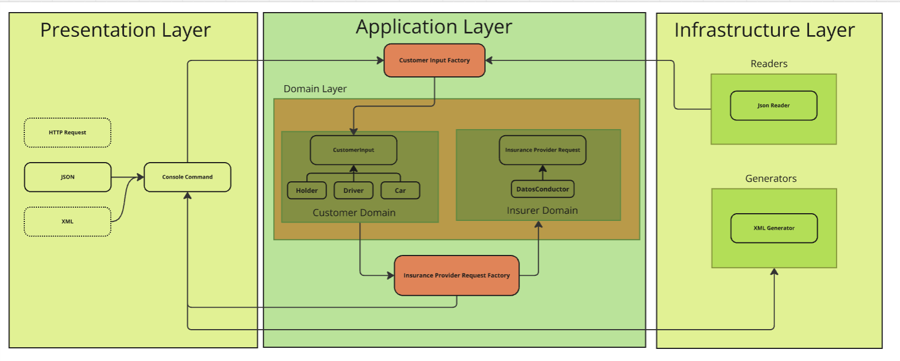
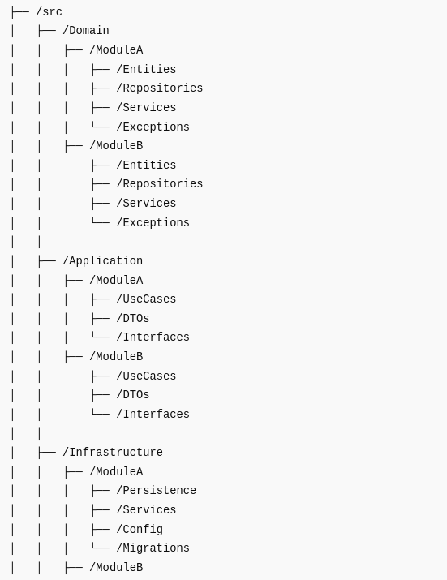
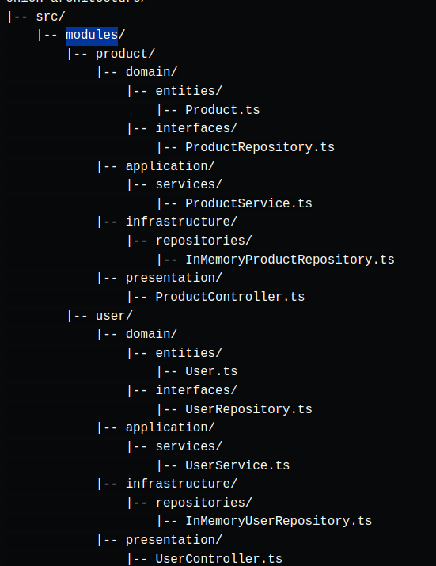

# Insurance Assessment

## Project Overview 
You can see the scenario in the following diagram.

<p></p>

- you can specify the input file in console

## Under the Hood
I used Symfony framework to connect services when needed. For example, I tried to use abstractions to decouple the objects.

Also, we are using custom **Exceptions** to handle the errors and exceptions in a more readable way.

I tried to follow Onion layer architecture for this project, though I know there is many considerations for the structure.
because after searching I found different implementation on Design. So I think every company tries to design on what they 
need on this occasion.

I Concluded that people follows 2 approaches for the onion architecture:
<p></p> <p></p>
Which based on the feedback and my Idea, I decided to follow second approach, In my opinion it is more readable.


I tried to set strict tests specially for date's, 

For Generating the xml, base on the feedback, I realized that we may have different objects of insurance provider request, 
for example `DatosConductor`, so I implemented a logic that automatically creates xml from the insurer domain and finally creates the 
Insurance provider request.

## Final Notes
I'm just thinking out load here, because we followed the onion architecture and separated the concerns, for me it is a good idea to send the final xml result to the EventBus(Messaging System) and by doing this, the appropriate modules can get the data from queue and proceed it how they want.

## Requirements

- docker
- docker-compose

## Installation

1. get the repo
    ````bash
    git pull git@github.com:saeidtaheri/check24-assessment.git
   ````
2. Change directory.
    ````bash
    cd check24-assessment
   ````
3. Start docker.
    ````bash
    docker-compose up -d
    ````
4. Enter to the container.
   ````bash
    docker compose exec -ucheck24 php bash
    ````
5. Install vendors.
    ````bash
   composer install
   ````
6. create env file
    ````bash
   cp .env.example .env
   ````
7. Run The console Command.
    ````bash
    ./bin/console insurance:generate-provider-request --file=/data/input.json
   ````
8. Run the tests.
   ````bash
   ./vendor/bin/phpunit tests --testdox
    ````
   
